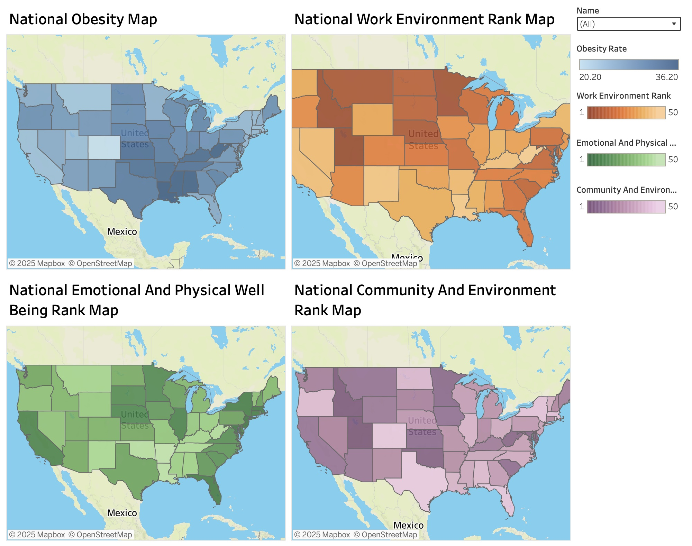

# 💫 Happiness Correlations in U.S. States
## Introduction
This project explores the key factors influencing happiness across U.S. states, focusing on the relationship between happiness, obesity rates, work environments, community conditions, and emotional/physical well-being. By understanding these connections, the aim is to propose policy recommendations that can improve people's quality of life and well-being across different regions in USA.

## Project Goals
- **Analyze happiness distribution** across states.
- **Investigate correlations between happiness and other factors** like obesity, work environment, community environment and well-being.
- **Provide policy recommendations** to enhance happiness.**↑**

## Data Overview
| Column                                    | Data Type | Description                                                                 |
|-------------------------------------------|-----------|-----------------------------------------------------------------------------|
| **State**                                 | String    | The name of the state                                                        |
| **Happiness Score**                       | Integer   | Happiness levels in each state                                               |
| **Obesity Rate**                          | Float     | Percentage of the population that is obese in each state                     |
| **Emotional & Physical Well-Being Rank**  | Integer   | The emotional and physical well-being ranking of each state                  |
| **Work Environment Rank**                 | Integer   | The work environment ranking of each state                                   |
| **Community & Environment Rank**          | Integer   | The ranking based on community and environmental conditions in each state    |

## Data Visualization
**Map:**  

